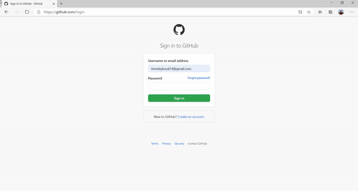

# KeyGen
Cards based password storer and generator for Windows.

[](https://sourceforge.net/projects/kovalskii-keygen/files/latest/download)

[](https://sourceforge.net/projects/kovalskii-keygen/files/latest/download)



## Getting the app 
The app can be got from [KeyGen sourceforge page](https://sourceforge.net/projects/kovalskii-keygen) for user purposes. Antivirus may sometimes treat the installer and the main executable file of the app as virus due to the absence of publisher's digital sign. **It is recommended to turn off antivirus during the instalation proccess,** but it is up to you to decide.

## Executing the code
From the project's directory:

```$ pip install requirements.txt```

```$ py main.py ```

Some resources of the app are compiled into binaries and stored in resources_rc.py file, but **Quicksand Medium** and **Quicksand Reqular** fonts used by the app are installed only while instalation proccess performed by installer. To get the same output by running ```py main.py``` you should install **Quicksand Medium** and **Quicksand Reqular** fonts by putting the .ttf files to *C:\Windows\Fonts*.

## Reporting a bug
Bugs can be reported through ["Bug reports" page](https://sourceforge.net/p/kovalskii-keygen/discussion/bugreports/) of sourceforge.

## Current project state
Stable: KeyGen 1.0

## Made with
- PyQt5
